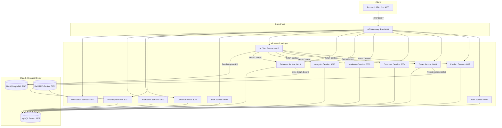

# LearnMart Marketplace: Developer Onboarding Guide

Welcome to the **LearnMart Marketplace** project! This document provides a comprehensive overview of the system architecture, service layouts, technology stack, current implementation status, and instructions on how to set up and run the system locally.

---

## 1. Overall Architecture & Design Principles

LearnMart is a multi-product e-commerce marketplace built using a **Domain-Driven Design (DDD)** and **Microservices** architecture. It was refactored and expanded from a legacy Bookstore model to support diverse categories such as books, stationery, toys, desk decor, backpacks, and other student accessories.



### Key Architectural Guidelines
1. **Database per Service**: Each microservice maintains its own relational database instance inside a shared MySQL server. Inter-service data consistency is managed using soft-references (by ID) rather than foreign key constraints.
2. **Synchronous REST Communication**: Services communicate synchronously via HTTP REST APIs for real-time reads (e.g., the AI service requesting a customer snapshot).
3. **Asynchronous Messaging**: RabbitMQ is used for decoupled, event-driven workflows (e.g., publishing `order.created` for inventory deductions and email notifications).
4. **Saga Orchestration Pattern**: The checkout process uses a local Saga orchestration flow in python to ensure transactional integrity across the `Order`, `Payment`, and `Shipping` aggregates.
5. **Personalized AI Layer**: User actions are tracked by the `Behavior Service`, aggregated into profiles, and mapped onto a Neo4j semantic graph database (`KB_Graph`). An `AI Chat Service` utilizes RAG (Retrieval-Augmented Generation) combined with deep sequence models (`biLSTM`) to recommend products.

---

## 2. Technology Stack

* **Backend Framework**: Python 3.11 with **FastAPI** & **Uvicorn** for all microservices.
* **ORM & Database Drivers**: **SQLAlchemy 2.0** and **PyMySQL**.
* **Frontend**: Pure Single Page Application (SPA) using **HTML5**, **Vanilla CSS**, and **Vanilla JavaScript** (served via a lightweight custom python webserver).
* **Relational Database**: **MySQL 8.0** (Port `3307` exposed on host, maps to standard port `3306` inside Docker container).
* **NoSQL / Graph Database**: **Neo4j 5.22** (Bolt port `7687`, HTTP console `7474`).
* **Message Broker**: **RabbitMQ 3** (Management Console on port `15672`).
* **Deep Learning Framework**: **PyTorch** (for the sequence behavior models: RNN/LSTM/biLSTM) and self-implemented **NumPy MLP Classifiers/Regressors** (used as a lightweight fallback).
* **Information Retrieval (RAG)**: **scikit-learn**'s `TfidfVectorizer` for text cosine-similarity over markdown policies.

---

## 3. Microservices Directory & Responsibilities

| Service | Port | Bounded Context | Description & Key APIs |
| :--- | :--- | :--- | :--- |
| `api_gateway` | `8000` | Gateway Routing | Reverse proxy entry point routing frontend traffic to microservices. |
| `frontend` | `4000` | UI Presentation | Single Page Application featuring standard marketplace views and a floating AI advisor. |
| `auth_service` | `8001` | Identity & Access | Customer/Staff registrations, credential hashing (bcrypt), and JWT verification. |
| `product_service`| `8002` | Catalog (DDD) | Manages products, categories, types, and reviews. Separated cleanly into `domain`, `application`, `infrastructure`, and `presentation` layers. |
| `order_service` | `8003` | Order & Checkout | Controls carts, order creation, payments, shipping, and refunds. Handles Python-based **Saga Orchestration** (`/checkout/saga`). |
| `customer_service`| `8004`| Customer Profile | Manages customer addresses, wishlists, preferences, and newsletter subscriptions. |
| `staff_service` | `8005` | Personnel | Handles internal department listings and staff details. |
| `marketing_service`| `8006`| Promotions | Handles coupons, active promotions, flash sales, and membership tiers. |
| `inventory_service`| `8007`| Inventory/Procurement| Manages warehouses, suppliers, purchase orders, stock levels, and threshold alerts. |
| `content_service` | `8008` | CMS Content | Manages frontend banner carousels, categories, and blogs. |
| `interaction_service`| `8009`| Loyalty / Gifts | Handles gift cards, membership points accrual, and sub-flows. |
| `analytics_service`| `8010` | Analytics Logs | Aggregates daily summaries, recently viewed products, and queries histories. |
| `notification_service`| `8011`| Notification | Formats email templates and broadcasts notifications upon RabbitMQ events. |
| `behavior_service`| `8013` | Behavior Analytics | Logs behavioral events (e.g. views, searches, carts), compiles visitor personas, and pushes real-time events into Neo4j. |
| `ai_chat_service` | `8012` | Cognitive layer | RAG Chatbot Advisor. Resolves questions by fetching RAG chunks, querying Neo4j subgraphs, and running sequential AI predictions. |

---

## 4. Implementation State & Checklist

### What is Already Implemented:
* [x] **DDD Product Catalog**: The product catalog operates inside `product_service` using strict DDD architecture.
* [x] **Saga Checkout Flow**: Orchestrated checkout transaction inside `order_service` with compensation logic (payment/shipping reserving/cancellation).
* [x] **Behavior Data Generator**: Script `ai_pipeline/generate_user_behavior_data.py` generates `data_user500.csv` containing 8 types of synthetic user behavior events across 500 users.
* [x] **Sequence Model Classifier**: Script `ai_pipeline/train_sequence_models.py` trains and evaluates RNN, LSTM, and biLSTM models. The best model (`biLSTM`) is saved as `model_best.pt` inside `ai_chat_service/models/`.
* [x] **Fallback MLP Classifier**: Pure NumPy-based neural network fallback implementation so the system works even if PyTorch sequence assets are unavailable.
* [x] **Graph-RAG Integration**: Real-time synchronization of customer events and catalog info to Neo4j. In addition to text matching (TF-IDF), the AI retrieves subgraphs describing customer's brand affinity, category popularity, and active promotions.
* [x] **Floating Chat Interface**: HTML/CSS floating chat window (`assistant.js`) connected to the API Gateway.
* [x] **Contextual UI Placements**: AI recommendations are rendered on Search listings and Cart summaries based on predicted buying intents.

### What is Missing, Incomplete, or Legacy:
*  **Legacy Database Naming**: Database schemas for `order_service` and `behavior_service` still use fields named `book_id` and `book_title` inside tables. These are mapped to `product_id` and `product_title` at the API Layer (Pydantic models) and Frontend layers to maintain backward compatibility with previous project states. Do not try to rename the columns directly in MySQL without modifying all internal ORM references.
*  **Sequential Saga Blockers**: The Saga transaction inside `order_service` is handled sequentially within a REST call (`/checkout/saga`) instead of asynchronously utilizing RabbitMQ message queues or an external workflow coordinator (like Temporal).
*  **Deprecated Scripts**: Avoid using `start_all.bat` or older migration scripts (`setup_and_migrate.py`, `migrate.py`) directly on host systems since they still refer to the deprecated `book_service` and outdated configuration configurations. Use Docker Compose instead.

---

## 5. Local Setup & Execution Guide

### Prerequisites
1. **Docker Desktop** & **Docker Compose**.
2. **Python 3.11** (If generating datasets or seeding data directly from the host).
3. Host package dependencies: `pip install requests pymysql sqlalchemy cryptography joblib numpy torch scikit-learn` (only required if running python scripts outside docker).

---

### Step-by-Step Running Guide

#### 1. Generate Behavior Dataset & Train Models
Before launching the microservices, you need to generate visitor profiles and train the sequence model:

```bash
# 1. Generate 500 users / 8 behaviors dataset
python ai_pipeline/generate_user_behavior_data.py

# 2. Train RNN/LSTM/biLSTM models (will save 'model_best.pt' for biLSTM)
python ai_pipeline/train_sequence_models.py
```

#### 2. Start all services using Docker Compose
Start the docker containers. This command will launch MySQL, Neo4j, RabbitMQ, the API Gateway, Frontend HTTP server, and all 13 microservices:

```bash
docker compose up --build -d
```
*(Wait 30-45 seconds for MySQL & Neo4j databases to finish initializing and health-checks to pass).*

#### 3. Database Migration & Catalog Seeding
Since all microservices call `Base.metadata.create_all` during their FastAPI startup events, MySQL tables are auto-created when the container starts. Run the seed scripts from your host to populate catalog items and demo profiles:

```bash
# Seed standard catalog (10 groups, brand, products, customers, and coupons)
python seed_data.py

# Seed AI-related behaviors and recent profiles
python seed_ai_demo.py
```

---

## 6. Accessing local services (Ports & URLs)

* **Frontend Application**: [http://localhost:4000](http://localhost:4000)
* **API Gateway**: [http://localhost:8000](http://localhost:8000)
* **RabbitMQ Management Dashboard**: [http://localhost:15672](http://localhost:15672) (User: `guest` / Pass: `guest`)
* **Neo4j Browser Console**: [http://localhost:7474](http://localhost:7474) (User: `neo4j` / Pass: `learnmart_graph_password`)

### Swagger Documentation Links
To inspect endpoint schemas and perform manual testing:
* Identity: `http://localhost:8001/docs`
* Catalog (DDD): `http://localhost:8002/docs`
* Checkout: `http://localhost:8003/docs`
* Customer: `http://localhost:8004/docs`
* Marketing: `http://localhost:8006/docs`
* Behavior Engine: `http://localhost:8013/docs`
* AI Orchestration: `http://localhost:8012/docs`

---

## 7. Default Credentials for Testing

* **Customer Account**:
  * Email: `demo@learnmart.vn`
  * Password: `demo123`
* **Staff/Admin Account**:
  * Username: `admin`
  * Password: `admin123`
