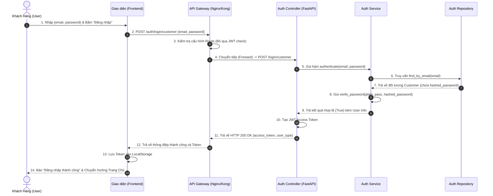
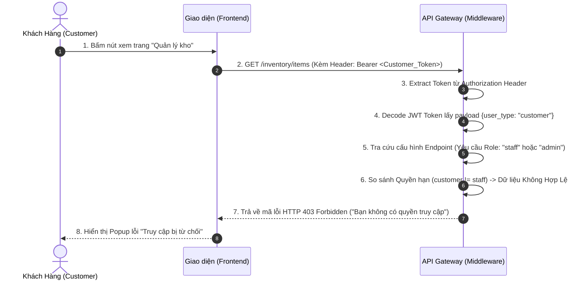
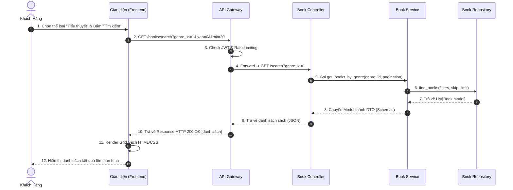
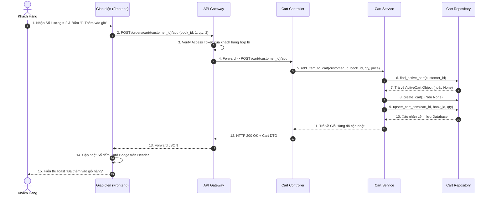
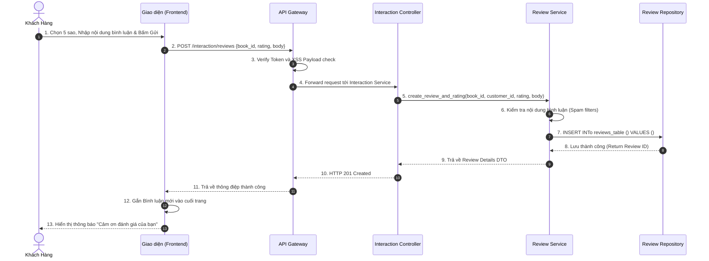
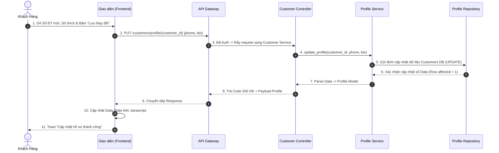
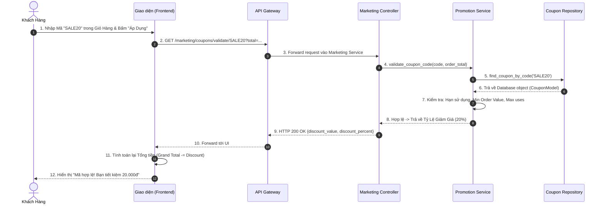
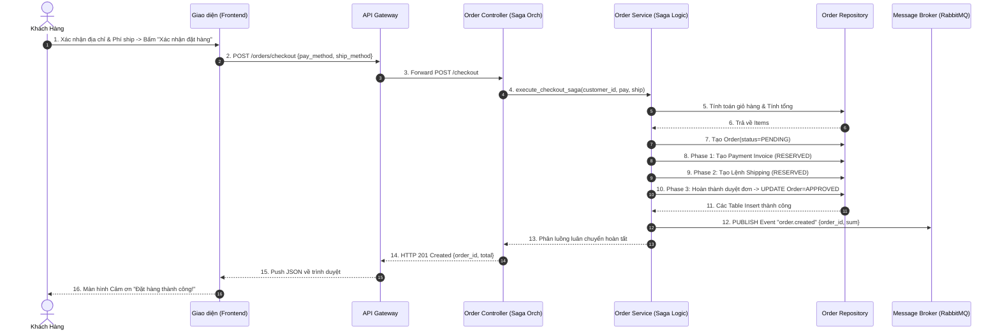
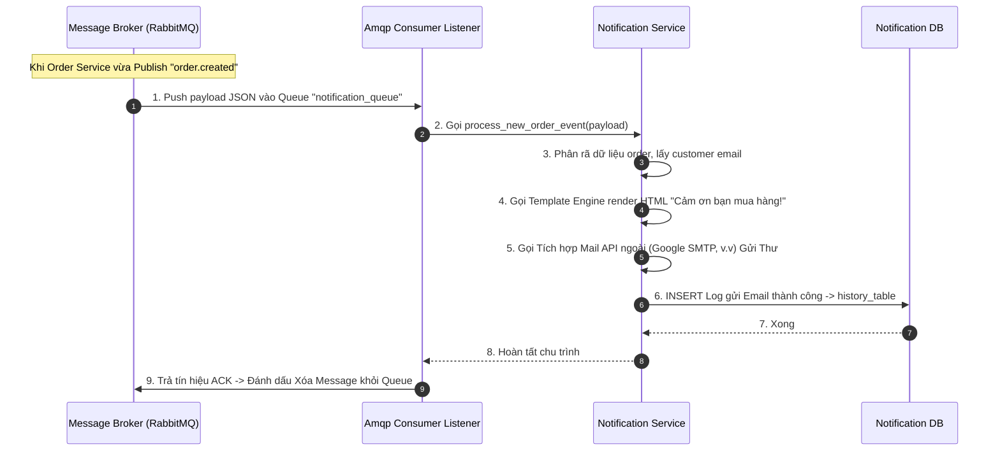
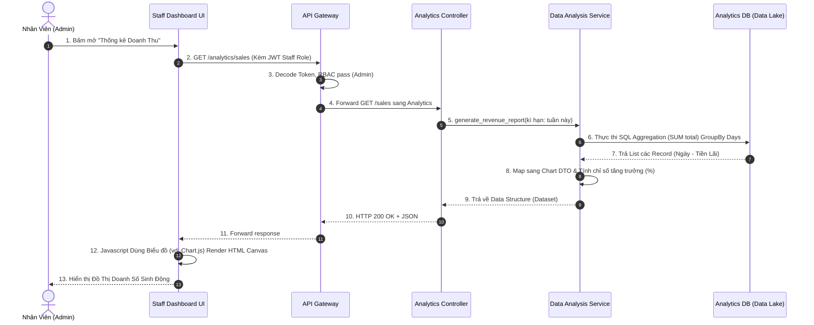

# TÀI LIỆU SEQUENCE DIAGRAM CHI TIẾT (CHUẨN KIẾN TRÚC)
Tài liệu này cung cấp 10 Sequence Diagram được thiết kế riêng **có đầy đủ các layer: Người dùng -> Giao diện -> Gateway -> Controller -> Service -> Repository** cùng các hành động (message) logic cụ thể ở từng nhịp. 

Các sơ đồ này cực kỳ phù hợp để bạn tái tạo (vẽ lại) trong **Visual Paradigm**, **Draw.io**, hay **StarUML** và bỏ vào báo cáo đồ án môn học.

---

## 1. Khách Hàng Đăng Nhập & Nhận Token (Auth Service)

---

## 2. API Gateway Kiểm tra Quyền Truy cập (RBAC) Bị Từ Chối

---

## 3. Duyệt & Tìm Kiếm Theo Thể Loại (Book Service)

---

## 4. Thêm Sách Vào Giỏ Hàng (Order Service)

---

## 5. Viết Bình Luận & Đánh Giá 5 Sao (Interaction Service)

---

## 6. Cập Nhật Hồ Sơ Của Khách Hàng (Customer Service)

---

## 7. Kiểm Tra & Áp Dụng Mã Giảm Giá (Marketing Service)

---

## 8. Đặt Hàng Thanh Toán Bằng Saga Pattern (Order Service)

---

## 9. Lắng Nghe Event Async Để Gửi Email (Notification Service)

---

## 10. Xem Báo Cáo Doanh Thu Hệ Thống (Analytics API)

